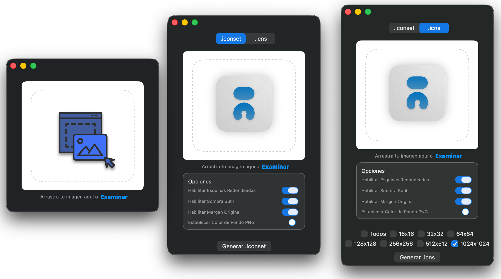

<h1 align="center">Icns Creator</h1>


<a href="README.md">
    
</a><br><br>

<p style="margin-top:20px" align="center">

</p>

<p align="center">Una aplicación nativa de macOS que convierte imágenes a archivos de iconos `.iconset` o `.icns`.</p>

<p align="center">
Descarga la aplicación desde <a href="https://github.com/perez987/Icns-creator/releases/latest">Releases</a><br>
(Soporta desde macOS 13 hasta macOS 26).<br>
</p>



## Inicio Rápido

Icns Creator es una aplicación de macOS que te permite crear fácilmente archivos icns o iconos desde cualquier archivo de imagen PNG o JPG. Con esta herramienta, puedes generar rápidamente archivos icns de alta calidad para usar como iconos en tus aplicaciones de macOS o generar un único archivo .iconset apropiado para ser incluido fácilmente en proyectos de Xcode.

## Créditos

*Alp Tuğan* es el creador del repositorio fuente [icns-creator](https://github.com/alptugan/icns-creator). El código principal proviene de ahí. Yo buscaba una interfaz gráfica para el comando xattr en macOS, preferiblemente en SwiftUI, y encontré este excelente proyecto que cumplía con mis requisitos.

Algunas facetas del proyecto no eran totalmente de mi gusto, e.g. el archivo README y el archivo ContentView.swift, que era excesivamente largo y contenía funciones y métodos que estarían mejor en clases separadas. Por este motivo hice cambios en README, código y estructura del proyecto Xcode.

## Registro de Cambios

Estos son los cambios que he realizado en este fork:

- Añadido `AppDelegate` para cerrar la aplicación cuando se cierra la ventana
- Añadido sistema de traducción: Inglés (predeterminado) y Español
- Funciona en macOS Tahoe
- Refactorización de `ContentView.swift` en módulos; reducción de `ContentView.swift` de 889 → 468 líneas extrayendo:
  - `IconGenerationService.swift`: `runShellCommand`, `processImage`, `runSipsCommand`, `generateCombinedIcns`
  - `ImageProcessing.swift`: `createRoundedImage`, manipulación de imágenes, conversión entre formatos
  - `FileSystemHelpers.swift`: extensión `NSOpenPanel`, diálogos de archivos, rutas del sistema
  - `WindowHelpers.swift`: utilidad `resizeWindow`
- Corregido el tamaño de ventana para nuevas ventanas abiertas con Cmd+N
- Corregidos elementos de UI superpuestos y ajuste de espaciado (los botones de generar iconos y las casillas de verificación de tamaño de icono se superponían con el grupo de Opciones)
- Corregido tamaño duplicado en nombres .icns
- Actualizada la aplicación para asegurar que Cmd+N abra nuevas ventanas con estado independiente, evitando la herencia de estado entre ventanas
- Deshabilitado el tabulado automático de ventanas para que las nuevas ventanas se abran por separado en lugar de como pestañas
- Usa el directorio de la imagen arrastrada como ubicación de guardado predeterminada. El diálogo aún permite navegar a cualquier destino; esto sólo establece la ubicación inicial.

## Características

- Interfaz de usuario simple e intuitiva.
- Soporte para formatos de archivo de imagen GIF, PNG, JPG, JPEG, TIFF e incluso PSD.
- Generación automática de archivos icns en tamaños variables.
- Generación de carpeta iconset y archivo individual .icns.
- Opciones para establecer el estilo de icono según los estándares de diseño de Apple (sombra sutil, radio de esquina, área de margen de icono)
- Internacionalización con selector de idioma.

## Advertencia de seguridad al abrir la aplicación

Las condiciones que Apple impone para mantener la seguridad y privacidad del usuario son cada vez más estrictas. Esto, por supuesto, beneficia a los usuarios pero tiene inconvenientes.

Cuando se descarga un archivo de Internet, se le añade un atributo extendido llamado `com.apple.quarantine` para que Gatekeeper solicite confirmación antes de ejecutarlo.

En versiones anteriores a Sequoia, la advertencia de Gatekeeper para archivos descargados de Internet tenía una solución simple: aceptar la advertencia al abrir el archivo o hacer clic derecho en el archivo -> "Abrir".

Pero en Sequoia y Tahoe, la advertencia es más seria y puede molestar al usuario. Puede mostrar este mensaje:
<br>`La aplicación está dañada y no se puede abrir.`<br>
O este otro:
<br>`No se pudo verificar que Download Full Installer no contenga software malicioso.`<br>
Con la recomendación en ambos casos de mover el archivo a la Papelera.

Esta es la advertencia que aparece cuando la aplicación no está firmada digitalmente o notarizada por Apple; en este otro caso la advertencia es más benigna, reminiscencia de las versiones anteriores a Sequoia.

Actualmente, se requiere una cuenta de desarrollador de Apple para firmar digitalmente o notarizar aplicaciones de Mac. Sin embargo, muchos desarrolladores no se registran en el Programa de Desarrolladores de Apple, ya sea por el costo o porque desarrollan pequeñas aplicaciones que se distribuyen gratuitamente.

Este es el caso de muchas de las aplicaciones que publicamos como aficionados, firmadas ad-hoc y no notarizadas. Aunque el código fuente de este tipo de aplicaciones generalmente está disponible y se puede explorar para determinar si hay condiciones que debiliten la seguridad, esta advertencia puede generar algunas sospechas.

Los usuarios que tienen Gatekeeper deshabilitado no verán esta advertencia. Sin embargo, deshabilitar Gatekeeper globalmente para ejecutar una sola aplicación no es una recomendación válida.

¿Cómo solucionarlo?

### Opción 1: Deshabilitar Gatekeeper (NO RECOMENDADO)

1.- **Deshabilitar Gatekeeper:** Abre la aplicación Terminal y ejecuta el siguiente comando: `sudo spctl —master-disable`:

- Nota: en versiones recientes de macOS, el argumento `—master-disable` ha  cambiado a `—global-disable`
- Ve a "Configuración del Sistema” → "Privacidad y Seguridad” → "Seguridad" → Permitir aplicaciones de "Cualquier lugar"
- Ambos argumentos pueden revertir esto y habilitar Gatekeeper nuevamente: `—master-enable` `—global-enable`
- A partir de este punto, las aplicaciones descargadas se ejecutarán sin avisos de seguridad

2.- Descarga la última versión desde la página de [Releases](https://github.com/perez987/icns-creator/releases).

3.- Mueve el archivo `Icns Creator.app` descomprimido a tu carpeta de Aplicaciones.

4.- Haz doble clic en el archivo `Icns Creator.app` para ejecutarlo.

5.- Se te mostrará una advertencia de que la aplicación es de un desarrollador no identificado. Haz clic en "Abrir".

> Deshabilitar Gatekeeper globalmente para ejecutar una sola aplicación no es una recomendación válida.

### Opción 2: Sin deshabilitar Gatekeeper

#### 1.- Configuración del Sistema >> Seguridad y Privacidad

Primero, ve a `Privacidad y Seguridad` para ver si hay un mensaje sobre el bloqueo de la aplicación descargada con la opción `Abrir de todos modos`.

Al hacer clic en `Abrir de todos modos`, macOS preguntará nuevamente si deseas abrir el archivo y, si respondes que sí, pedirá la contraseña de usuario y lo abrirá.

Esta es la forma más fácil de solucionarlo.

#### 2.- Herramienta de línea de comandos xattr

`xattr` maneja atributos extendidos (*xattrs*), que son metadatos adicionales adjuntos a archivos y directorios más allá de la información estándar como nombre o tamaño. Esta herramienta está integrada en macOS de forma nativa. Con `xattr` puedes eliminar el atributo `com.apple.quarantine` de cualquier archivo descargado de Internet y la tarea es bastante simple.

- `xattr` sin argumentos muestra los atributos extendidos:

```
> sudo xattr /Applications/Icns\ creator.app
> com.apple.quarantine
```

- `xattr -cr` elimina todos los atributos extendidos:

`> sudo xattr -cr /Applications/Icns\ creator.app`

- Después de este comando, `xattr` ya no muestra el atributo extendido `com.apple.quarantine`:

```
> sudo xattr /Applications/Icns\ creator.app 
> (sin salida)
```

#### 3.- Xattr Editor

Xattr Editor es una aplicación GUI simple para ver/editar atributos extendidos de archivos en macOS, tiene su propio [repositorio](https://github.com/perez987/Xattr-Editor/blob/master/README-ES.md).

#### 4.- Resultado

De cualquier manera, deshabilitando Gatekeeper, Configuración del Sistema, "xattr" o Xattr Editor, a partir de este punto, la aplicación descargada se ejecutará sin avisos de seguridad porque el atributo `com.apple.quarantine` ha sido eliminado.

### Opción 3 (Para desarrolladores)

Compilar la aplicación tú mismo o realizar modificaciones en el código fuente (Opcional). Si tienes problemas debido a cuestiones de seguridad de Apple, o prefieres no instalar aplicaciones listas para usar, puedes compilar la aplicación tú mismo y también revisar el código.

Nota: No necesitas eliminar el atributo `com.apple.quarantine` si descargas el código fuente, compilas la aplicación con Xcode y guardas el producto para uso regular. Cuando compilas una aplicación en Xcode y la configuras para Firmar para Ejecutar Localmente, Xcode la firma con un certificado local confiable para que el sistema pueda ejecutarla. Si `Hardened Runtime` está deshabilitado, la aplicación no necesita la certificación de Apple y seguirá funcionando normalmente en tu Mac. Por eso no ves la advertencia de seguridad.

#### Obtener el Código

Clona el repositorio:

```bash
git clone https://github.com/perez987/Icns-creator.git
cd Icns-creator
```

#### Usando Xcode

1. Abre el proyecto con Xcode
2. Selecciona tu Mac como destino de ejecución
3. Presiona `Cmd+R` para compilar y ejecutar la aplicación

#### Compilando desde la Línea de Comandos

1. Abre Terminal
2. Navega al directorio del proyecto
3. Compila el proyecto:
 
   ```bash
   swift build -c release
   ```
4. Ejecuta la aplicación:
 
   ```bash
   .build/release/Icns-creator
   ```

## Uso para Diseñadores y Desarrolladores

1. Prepara tu archivo de imagen en tu editor de imágenes preferido, asegurándote de que tenga un tamaño mínimo de 1024x1024 píxeles.
2. Guarda el archivo de imagen como un archivo PNG o JPG en una relación de aspecto 1:1 para obtener los mejores resultados.
3. Abre la aplicación Icns Creator.
4. Haz clic en el botón `Examinar` o arrastra y suelta la imagen.
5. La pestaña `.iconset` crea un único archivo de icono (1024x1024) y una carpeta que contiene archivos PNG requeridos por Xcode (`Assets.xcassets/AppIcon.appiconset`)
6. La pestaña `.icns` crea archivos .icns individuales en los tamaños previamente seleccionados.
7. Por defecto, la sombra, las esquinas redondeadas y el relleno para el icono generado están habilitados. Para los estándares recientes de Mac OS, debes habilitar todas las opciones para aplicar los estándares de diseño de Apple. Si solo quieres generar archivos .icns como antes, deshabilita todas las opciones.
8. Los archivos se crearán en el mismo directorio que el archivo de imagen original.

## Contribución

¡Las contribuciones a Icns Creator son bienvenidas! Si deseas contribuir al proyecto, sigue estos pasos:

1. Haz un fork del repositorio.
2. Crea una nueva rama para tu característica o corrección de error (opcional).
3. Realiza tus cambios y confírmalos con mensajes de confirmación descriptivos.
4. Por favor, no elimines códigos comentados 😉.
5. Envía tus cambios a tu repositorio bifurcado.
6. Abre una solicitud de extracción en el repositorio principal, explicando tus cambios y sus beneficios.

## Licencia

Icns Creator se publica bajo la Licencia MIT. Consulta el archivo [LICENSE](https://github.com/perez987/icns-creator/blob/main/LICENSE.md) para más información.

## Reconocimientos

- La aplicación Icns Creator fue inspirada por la necesidad de una herramienta simple y eficiente para crear archivos icns e iconos para aplicaciones de macOS.

## Contacto

Si tienes alguna pregunta, sugerencia o comentario, no dudes en usar la sección de Issues.

## Por hacer

- [x] ~~Lanzamiento de la aplicación~~
- [x] ~~Hacerla compatible con mínimo macOS 11.0~~
- [x] ~~Hacerla compatible con máximo macOS 26~~
- [x] ~~Arrastrar y soltar archivos de diseño en la ventana de la aplicación~~
- [x] ~~Añadir característica para exportar iconos con esquinas redondeadas~~ 
- [x] ~~Añadir característica para exportar iconos con relleno según los estándares de diseño de Apple~~
- [x] ~~Añadir característica para exportar iconos con opción de sombra~~ 
- [x] ~~Establecer icono original~~
- [x] ~~Eliminar archivo PNG después de la creación de los archivos .icns individuales~~
- [x] ~~Preguntar por el destino para guardar archivos...~~
- [x] ~~Mejor UI para mostrar opciones de cambio de alternancia~~
- [x] ~~Lanzamiento mayor v3~~
- [x] ~~Mejorar documentación sobre compilación del proyecto.~~
- [x] ~~Verificar el último lanzamiento en una Mac basada en Intel (la Arquitectura Rosetta puede ayudar a solucionar problemas para chip Intel).~~
- [x] ~~Añadir vista previa para opciones cambiadas~~
- [x] ~~Diálogo de ruta de destino~~
- [x] ~~Problema con el nombre del archivo. Cuando hay espacio en blanco en el nombre del archivo, el proceso falla. `code solid.svg` - fallo. `code-solid.svg` - éxito~~
- [x] ~~Rellenar el fondo con un color o un patrón~~
- [x] ~~Salir de la aplicación cuando se hace clic en el botón cerrar~~
- [x] ~~Deshabilitar tabulado automático de ventanas para Cmd+N~~
- [x] ~~Corregir Cmd+N para abrir ventana nueva en lugar de heredar estado~~
- [x] ~~Añadir internacionalización con selector de idioma de la aplicación~~
