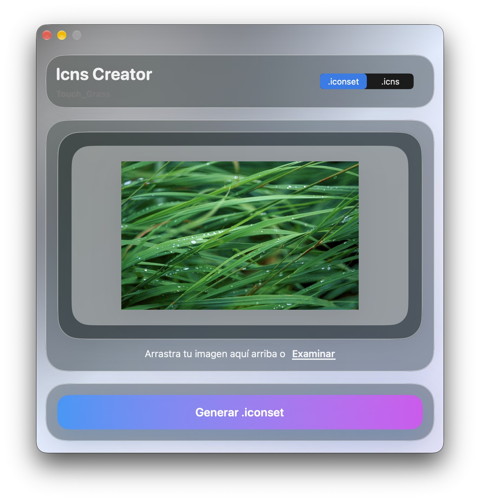
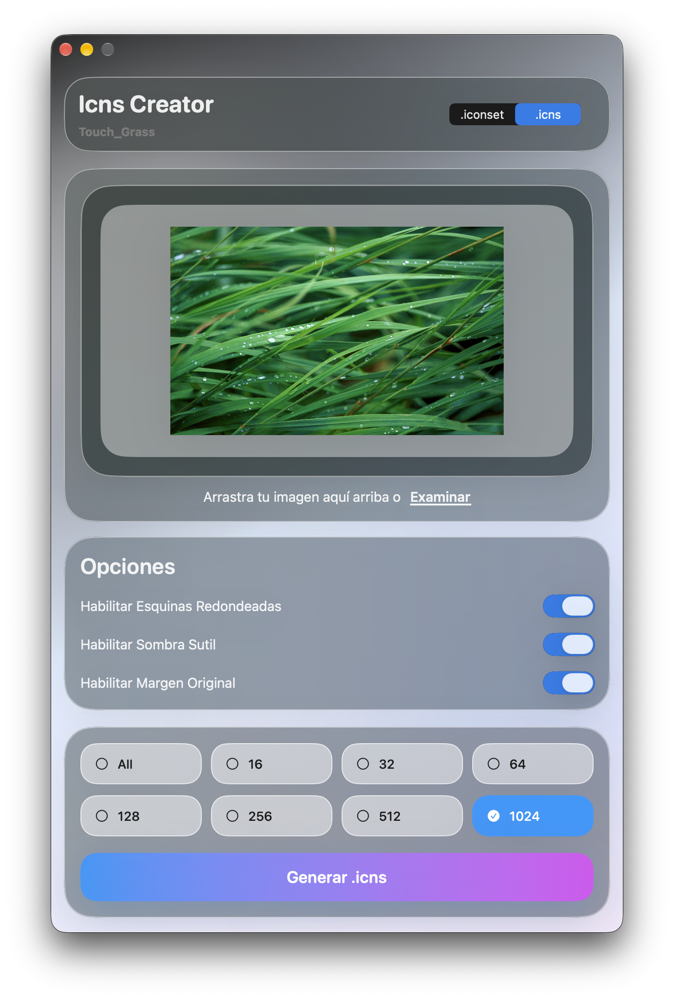

<h1 align="center">Icns Creator</h1>


<p align="center">Una aplicación nativa para macOS que convierte imágenes en archivos de icono `.iconset` o `.icns`.</p>

<p align="center">
Descarga la aplicación desde <a href="https://github.com/perez987/Icns-creator/releases/latest">Releases</a><br>
(Compatible desde macOS 13 hasta macOS 26).<br>
</p>

|  | 
|:----|
|  |
|  |

Icns Creator es una aplicación de macOS que permite crear fácilmente archivos .icns o paquetes de iconos .icomset a partir de cualquier archivo de imagen PNG o JPG. Con esta herramienta, puedes generar rápidamente archivos .icns de alta calidad para utilizarlos como iconos de tus aplicaciones de macOS, o generar un único archivo `.iconset` adecuado para incluirlo fácilmente en proyectos de Xcode.

## Créditos

*Alp Tuğan* es el creador del repositorio original [icns-creator](https://github.com/alptugan/icns-creator). El código principal procede de allí. Estaba buscando una aplicación con interfaz gráfica que realizara esta tarea en macOS, preferiblemente en SwiftUI, y encontré este excelente proyecto, que cumplía mis requisitos.

## Registro de cambios

Estos son los cambios que he realizado en mi proyecto:

- La aplicación está notarizada por Apple
- Se ha modificado `README.md` y añadido 'README-ES.md`'
- Se añadió `AppDelegate` para cerrar la aplicación al cerrar la ventana
- Se añadió un sistema de localización: inglés (predeterminado), alemán, francés, italiano y español, con selector de idioma
- Funciona en macOS 13 Ventura hasta Golden Gate
- Se refactorizó `ContentView.swift` en módulos: se redujo `ContentView.swift` de 889 a 468 líneas mediante la extracción de 4 módulos que ayudan a mantener el código organizado y a su mantenimiento: `IconGenerationService.swift`, ImageProcessing.swift`, FileSystemHelpers.swift` y `WindowHelpers.swift`
- Se corrigió el tamaño de ventana para las nuevas ventanas abiertas mediante `Cmd+N`
- Se corrigieron los elementos superpuestos de la interfaz y se ajustó el espaciado (los botones de generación y las casillas de tamaño de icono se superponían con el grupo Opciones)
- Se corrigió el tamaño duplicado en los nombres de archivos `.icns`
- Se actualizó la aplicación para garantizar que `Cmd+N` abra nuevas ventanas con estado independiente, evitando que el estado se herede entre ventanas
- Se desactivó la agrupación automática de ventanas en pestañas para que las ventanas nuevas se abran por separado en lugar de como pestañas
- Se utiliza el directorio de la imagen arrastrada como ubicación de guardado predeterminada. El diálogo sigue permitiendo navegar a cualquier destino; esto solo establece la ubicación inicial
- Se actualizó el diseño de la interfaz para hacerlo más moderno y fácil de usar
- Se conserva el canal alfa PNG al exportar `.icns` y `.iconset`
- El aspecto de la vista previa de la imagen seleccionada se ha unificado para ambas pestañas, `.iconset` e `.icns`.

## Características

- Interfaz de usuario sencilla e intuitiva
- Compatibilidad con formatos de imagen PNG, JPG, JPEG, TIFF, HEIC e incluso PSD
- Generación automática de archivos `icns` en varios tamaños
- Generación de carpetas `iconset` y de archivos `.icns` individuales
- Las exportaciones de `.iconset` aplican automáticamente esquinas redondeadas al estilo de Apple, sombra sutil y relleno a cada PNG generado
- Opciones de estilo para `.icns` conforme a los estándares de diseño de Apple: sombra sutil, radio de esquina y margen del icono
- Sistema de traducciones con selector de idioma.

#### Obtener el código

Clona el repositorio:

```bash
git clone https://github.com/perez987/Icns-creator.git
cd Icns-creator
```

#### Uso con Xcode

1. Abre el proyecto con Xcode
2. Selecciona tu Mac como destino de ejecución
3. Pulsa `Cmd+R` para compilar y ejecutar la aplicación.

#### Compilación desde la línea de comandos

1. Abre Terminal
2. Ve al directorio del proyecto
3. Compila el proyecto:

   ```bash
   swift build -c release
   ```
4. Ejecuta la aplicación:

   ```bash
   .build/release/Icns-creator
   ```

## Uso para diseñadores y desarrolladores

1. Prepara el archivo de imagen en tu editor de imágenes preferido, asegurándote de que tenga un tamaño mínimo de 1024x1024 píxeles
2. Guarda el archivo de imagen como PNG o JPG (u otro de los archivos soportados) con una relación de aspecto 1:1 para obtener los mejores resultados
3. Abre la aplicación Icns Creator
4. Haz clic en el botón `Explorar` o arrastra y suelta la imagen
5. La pestaña `.iconset` crea un único archivo de icono (1024x1024) y una carpeta con los archivos PNG requeridos por Xcode (para la carpeta `Assets.xcassets/AppIcon.appiconset`). Estos PNG reciben automáticamente las mismas esquinas redondeadas, sombra sutil y relleno que se usan para los iconos de aplicaciones al estilo de Apple
6. La pestaña `.icns` crea archivos `.icns` individuales en los tamaños seleccionados previamente
7. Las esquinas redondeadas, la sombra y el relleno están disponibles en la pestaña `.icns` (estándares de diseño recientes de macOS, debes activar las opciones que quieras aplicar a las variantes `.icns` generadas)
8. Los archivos se crearán en el mismo directorio que el archivo de imagen original.

## Contribución

¡Las contribuciones a Icns Creator son bienvenidas! Si deseas contribuir al proyecto, sigue estos pasos:

1. Haz un `fork` del repositorio
2. Crea una nueva rama para tu funcionalidad o corrección de errores (opcional)
3. Realiza los cambios y confírmalos con mensajes de `commit` descriptivos
4. No elimines los códigos comentados, por favor 😉
5. Sube los cambios a tu repositorio
6. Abre una solicitud de incorporación ('pull request`) en el repositorio principal, explicando tus cambios y sus beneficios.

## Licencia

Icns Creator se publica bajo la licencia MIT. Consulta el archivo [LICENSE](https://github.com/perez987/icns-creator/blob/main/LICENSE.md) para obtener más información.

## Agradecimientos

- La aplicación Icns Creator surgió de la necesidad de contar con una herramienta sencilla y eficiente para crear archivos `.icns e iconos para aplicaciones de macOS y para proyectos Xcode.

## Contacto

Si tienes preguntas, sugerencias o comentarios, no dudes en utilizar la sección de `Issues`.

## Tareas pendientes

- [x] ~~Lanzamiento de la aplicación~~
- [x] ~~Hacerla compatible con macOS 13.0 como mínimo~~
- [x] ~~Hacerla compatible con macOS 27 como máximo~~
- [x] ~~Arrastrar y soltar archivos en la ventana de la aplicación~~
- [x] ~~Añadir la función de exportar iconos con esquinas redondeadas~~
- [x] ~~Añadir la función de exportar iconos con relleno conforme a los estándares de diseño de Apple~~
- [x] ~~Añadir la función de exportar iconos con opción de sombra~~
- [x] ~~Establecer icono original~~
- [x] ~~Eliminar el archivo PNG después de crear los archivos `.icns` individuales~~
- [x] ~~Solicitar el destino donde guardar los archivos...~~
- [x] ~~Mejor interfaz para mostrar las opciones~~
- [x] ~~Lanzar la versión principal 3~~
- [x] ~~Mejorar la documentación sobre la compilación del proyecto~~
- [x] ~~Comprobar la última versión en un Mac con procesador Intel (la arquitectura Rosetta puede ayudar a resolver problemas con el chip Intel)~~
- [x] ~~Añadir una vista previa de las opciones modificadas~~
- [x] ~~Diálogo para elegir ruta de destino~~
- [x] ~~Problema con el nombre de archivo. Cuando hay un espacio en blanco en el nombre, el proceso falla. `code solid.svg`: falla. `code-solid.svg`: correcto~~
- [x] ~~Cerrar la aplicación al hacer clic en el botón de cerrar la ventana~~
- [x] ~~Desactivar la agrupación automática de ventanas en pestañas para `Cmd+N`~~
- [x] ~~Corregir `Cmd+N` para abrir una ventana nueva sin heredar el estado~~
- [x] ~~Añadir un sistema de localización con selector de idioma~~
- [x] ~~Actualizar el diseño de la interfaz para hacerlo más moderno y fácil de usar~~
- [x] ~~Conservar el canal alfa PNG al exportar `.icns` y `.iconset`~~
- [x] ~~Unificar la vista previa de imagen en las pestañas `.icns` y `.iconset`~~
