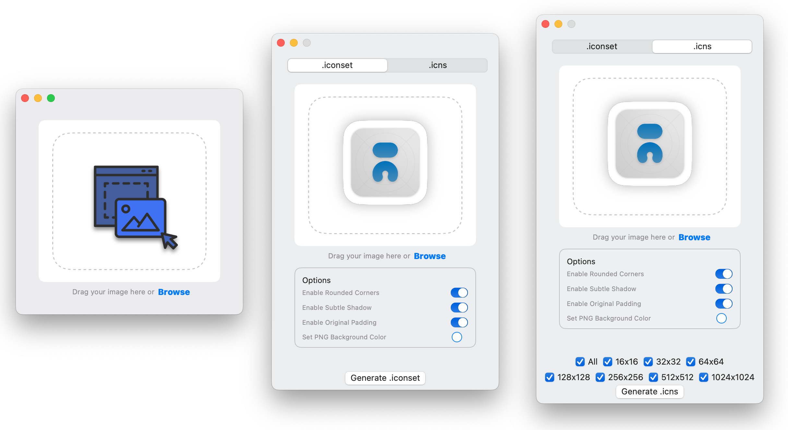
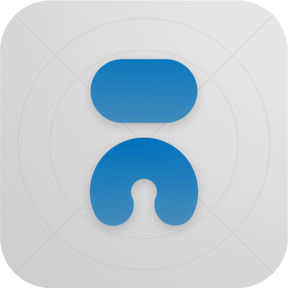
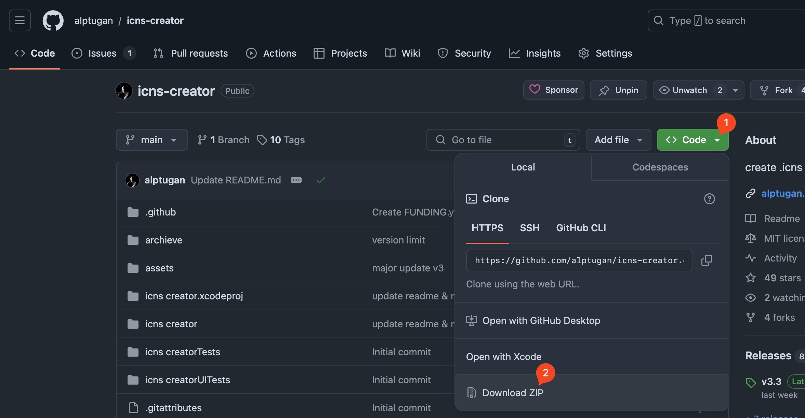
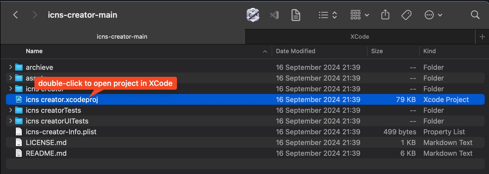

<h1 align="center">Icns Creator</h1>

<p align="center">A native Mac OS app that converts images to `.iconset` or `.icns` icon files.</p>
<!--p align="center">﹏﹏ ‿︵ ﹏﹏</p-->

<p align="center">・・・・・・・・・・ ༄ ・・・・・・・・・・</p> 

<p align="center">
Download the app from <a href="https://github.com/perez987/Icns-creator/releases/latest">Releases</a><br>
(Requires minimum Mac OS 11.0 - 26.2).<br>
<strong style="color:#ff9900">⚠️ PLEASE FOLLOW "Installation" instructions ⚠️</strong>
</p>



<p style="margin-top:20px" align="center">

</p>

## Instructions & QuickStart

The UI is a lot different with the v1. Icns Creator is a macOS application that allows you to easily create icns or icons files from any PNG or JPG image file. With this tool, you can quickly generate high-quality icns files to use as icons for your macOS applications or generate a single appropriate .iconset file.

Codesigning is an headache for me! And I do not want to pay for an app that I release as open-source. You can review the code, if you have concerns about the app. Or simply, you can choose not to use the app 🖖🏻.

<p align="center"> ⁂ </p>

## Features

- Simple and intuitive user interface.
- Support for GIF, PNG, JPG, JPEG, TIFF and even PSD image file formats.
- Automatic generation of icns files in variable sizes.
- iconset folder and individual .icns file generation.
- Options to set icon style for Apple design standarts (subtle shadow, corner radius, icon margin area).

<p align="center"> ⁂ </p>

## Installation

The conditions Apple imposes to maintain user security and privacy are becoming increasingly strict. This, of course, benefits users but it has drawbacks.

When a file is downloaded from the Internet, an extended attribute named `com.apple.quarantine` is added to it so that Gatekeeper requests confirmation before executing them.

In pre-Sequoia versions, Gatekeeper warning for files downloaded from the Internet had a simple solution: accepting the warning when opening the file or right-clicking on the file -> “Open”.

But in Sequoia and Tahoe, the warning is more serious and might upset the user. It may display this message:
<br>`The application is damaged and cannot be opened.`<br>
Or this one:
<br>`Could not verify that Download Full Installer does not contain malicious software.`<br>
With the recommendation in both cases to move the file to the Trash.

How to fix this?

### Option 1: Disable Gatekeeper (NOT RECOMMENDED)

1.- **Disable Gatekeeper:** Open the Terminal app on your Mac and run the following command: `sudo spctl —master-disable`:

- Note: in recent macOS versions, the argument `—master-disable` has been changed to `—global-disable`
- Go to "System Settings"->"Privacy & Security"->"Security" -> Allow applications from "Everywhere"
- Both arguments can revert this and enable Gatekeeper again:  `—master-enable`  `—global-enable`
- From this point on, downloaded apps will run without security prompts

2.- Download the latest release from the [Releases](https://github.com/perez987/icns-creator/releases) page.

2.- Move the unzipped `Icns Creator.app` file to your Applications folder.

4.- Double-click the `Icns Creator.app` file to run it.

5.- You will be prompted with a warning that the app is from an unidentified developer. Click "Open”.

> Disabling Gatekeeper globally to run a single application is not a valid recommendation.

<p align="center"> ⁂ </p>

### Option 2: Without disabling Gatekeeper

#### 1.- System Settings >> Security and Privacy

First, go to `Privacy & Security` to see if there's a message about blocking the downloaded application with `Open Anyway `option. This is the easiest way to fix it.


By clicking `Open Anyway`, macOS will ask again if you want to open the file and, if you answer yes, it will ask for the user password and open it.

#### 2.- xattr command line tool

`xattr`handles extended attributes (*xattrs*), which are additional metadata attached to files and directories beyond standard information like name or size. This tool is built into macOS natively. With `xattr` you can remove the `com.apple.quarantine` attribute from any file downloaded from Internet and the task is quite simple.

- `xattr` without arguments displays extended attributes:

```
> sudo xattr /Applications/Icns\ creator.app
> com.apple.quarantine
```

- `xattr -cr` removes all extended attributes:

`> sudo xattr -cr /Applications/Icns\ creator.app`

- After this command, `xattr` no longer displays `com.apple.quarantine` extended attribute:

```
> sudo xattr /Applications/Icns\ creator.app 
> (no output)
```

#### 3.- Xattr Editor

Xattr Editor is a simple GUI application to view/edit extended file attributes on macOS, it has their own [repository](https://github.com/perez987/Xattr-Editor).

#### 4.- Result

Either way, disabling Gatekeeper, System Settings, “xattr”or  Xattr Editor, from this point on, the downloaded app will run without security prompts because the `com.apple.quarantine` attribute has been removed.

<p align="center"> ⁂ </p>

### Option 3 (For developers)

To build the app by yourself or make modifications on the source code (Optional). If you have issues because of Apple's security issues, or you do not prefer to install compiled apps, you can compile the app by yourself and review the code as well.

1. Install XCode application from Appstore.
2. Download or clone the repository.<br>
<p style="margin-bottom:20px" align="center">
    
</p>
3. Unzip the folder and Double-click `Icns creator.xcodeproj` file to open it in XCode.
<p style="margin-bottom:20px" align="center">
    
</p>
4. Hit `Run` button to compile the project.
<p style="margin-bottom:20px" align="center">
    
</p>
5. If everything goes well hopefully, you can find the app under the XCode's Product menu.<br>
<p style="margin-bottom:20px" align="center">
    
</p>
<p align="center"> ⁂ </p>

## Usage for Designers & Developers

1. Prepare your image file in your preferred image editor, ensuring it has a minimum size of 1024x1024 pixels.
2. Save the image file as a PNG or JPG file in a 1:1 aspect ratio for the best results.
3. Open the Icns Creator application.
4. Click the `Browse` button or drag & drop the image.
5. `.iconset` tab creates a single icon file, or `.icns` tab creates individual .icns files required for html pages.
6. By default shadow, rounded corners and padding for the generated icon is enabled. For recent Mac OS standards, you should enable all of the options to apply Apple Design standards. If you just want to generate .icns files as before, disable all of the options.
7. The files will be created in the same directory as the original image file.

<p align="center"> ⁂ </p>

## Contribution

Contributions to Icns Creator are welcome! If you would like to contribute to the project, please follow these steps:

1. Fork the repository.
2. Create a new branch for your feature or bug fix.
3. Make your changes and commit them with descriptive commit messages.
4. Do not delete commented codes please 😉.
4. Push your changes to your forked repository.
5. Open a pull request in the main repository, explaining your changes and their benefits.

<p align="center"> ⁂ </p>

## Star History

[](https://star-history.com/#alptugan/icns-creator&Date)

<p align="center"> ⁂ </p>

## License
Iicns Creator is released under the [MIT License](https://opensource.org/licenses/MIT). See the [LICENSE](https://github.com/alptugan/icns-creator/blob/main/LICENSE.md) file for more information.

<p align="center"> ⁂ </p>

## Acknowledgements

- The Icns Creator app was inspired by the need for a simple and efficient tool to create icns and icons files for macOS applications. 

<p align="center"> ⁂ </p>

## Contact

If you have any questions, suggestions, or feedback, please feel free to use Issues section.

<p align="center"> ⁂ </p>

## To do

- [x] ~~App release~~
- [x] ~~Make it compatible with min Mac OS 11.0~~
- [x] ~~Drag & drop design files onto the app window~~
- [x] ~~Release major v2~~
- [x] ~~Add feature to export icons with rounded-corners~~ 
- [x] ~~Add feature to export icons with padding depending on Apple design standards~~
- [x] ~~Add feature to export icons with shadow option~~ 
- [x] ~~Set original icon~~
- [x] ~~Delete PNG file after creation of the individual .icns files~~
- [x] ~~Ask for destination to save files...~~
- [x] ~~Better UI to show switch toggle options~~
- [x] ~~Release major v3~~
- [x] ~~Improve documentation on compiling the project.~~
- [x] ~~Check the latest release on a Intel-based Mac (Rosetta Architecture may help to fix issues for Intel chip).~~
- [x] ~~Add preview for changed options~~
- [x] ~~Destination path dialog~~
- [x] ~~File name issue. When there is blank space in filename, the process fails. `code solid.svg` - failed. `code-solid.svg` - success~~
- [x] ~~‼️ Fill the background with a color or a pattern~~
- [x] ~~Quit app when clicked close button~~
- [x] ~~Support for macOS Tahoe~~
- [ ] ‼️ Lights around the app icon. Angle (Tahoe)
- [ ] ‼️ Set the size of the imported icon (Tahoe)
- [ ] ‼️ Display the icon grid similar to icon designer (Tahoe)
- [ ] v4
    - [ ] Drag & drop folders or apps to edit their icns props on the fly for better UX
    - [ ] Set the icons using the app
    - [ ] Return to original icon option
    - [ ] Keep the original icon in the original app directory
    - [ ] Update YouTube video tutorial
- [ ] Optional: A workaround for testing, and permissions. Test the app on a fresh Mac
- [ ] Optional: Distribute image conversion process into different CPU threads. It is a possible fix to avoid locking main thread during the icns creation process
- [ ] Optional: Distribute through Homebrew or any other package manager
- [ ] Optional: Apple Codesign issues! (Will exist forever because of Apple's buggy developer registration process) 
- [ ] Optional: Set options for rounded corners: None, Rounded, Circular, Tahoe OS.
