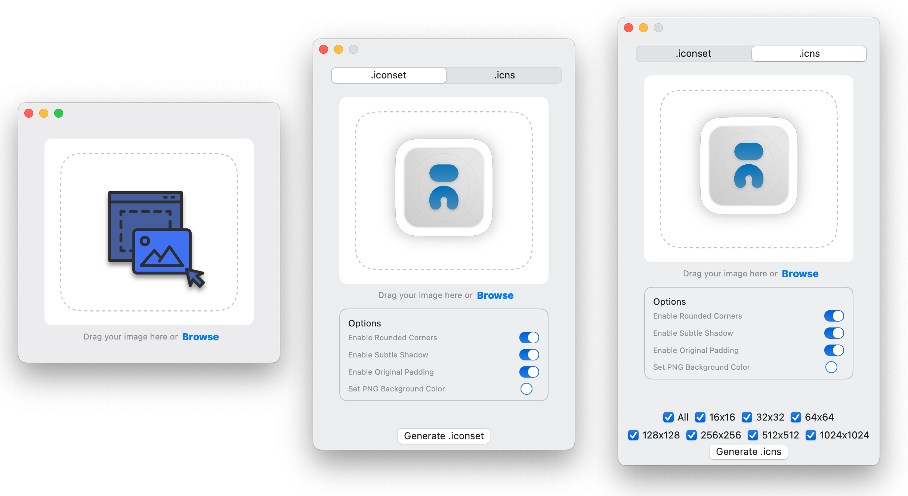

<h1 align="center">Icns Creator</h1>


<a href="README-ES.md">
    
</a><br><br>

<p style="margin-top:20px" align="center">

</p>

<p align="center">A native macOS app that converts images to `.iconset` or `.icns` icon files.</p>

<p align="center">
Download the app from <a href="https://github.com/perez987/Icns-creator/releases/latest">Releases</a><br>
(Supports macOS 13 up to macOS26).<br>
</p>



Icns Creator is a macOS application that allows you to easily create icns or icons files from any PNG or JPG image file. With this tool, you can quickly generate high-quality icns files to use as icons for your macOS applications or generate a single appropriate .iconset file to be easily included in Xcode projects.

## Credits

 *Alp Tuğan* is the creator of the source repository [icns-creator](https://github.com/alptugan/icns-creator). The main code comes from there. I was looking for a GUI app doing this task on macOS, preferably in SwiftUI, and I came across this excellent project that met my requirements.

Some aspects of the project were not entirely to my liking, e.g. the README file, the ContentView.swift file, which was excessively long and contained functions and methods that would be better in separate classes, or the Gatekeeper recomendation as a way to bypass macOS warning in files downloaded from Internet. For this reason I made changes to README, code and structure of the Xcode project.
 
## Changelog

These are the changes I've made in this fork:

- App notarized by Apple
- Modified README.md
- Add `AppDelegate` to quit app when window closes
- Add localization System: English (default), German, French, Italian and Spanish
- Succesfully checked on macOS Tahoe
- Refactor `ContentView.swift` into domain modules: reduced `ContentView.swift` from 889→468 lines by extracting:
  - `IconGenerationService.swift`: `runShellCommand`, `processImage`, `runSipsCommand`, `generateCombinedIcns`
  - `ImageProcessing.swift`: `createRoundedImage`, image manipulation, format conversion
  - `FileSystemHelpers.swift`: `NSOpenPanel` extension, file dialogs, path operations
  - `WindowHelpers.swift`: `resizeWindow` utility
- Fix window sizing for new windows opened via Cmd+N
- Fix overlapping UI elements and adjusting spacing (the generate buttons and icon size checkboxes were overlapping with the Options group)
- Fix duplicated size in .icns names
- Updated the app to ensure Cmd+N opens new windows with independent state, preventing state inheritance between windows
- Disabled automatic window tabbing so new windows open separately instead of as tabs
- Use dropped image directory as default save location. Dialog still allows navigation to any destination; this only sets the initial location.

## Features

- Simple and intuitive user interface.
- Support for GIF, PNG, JPG, JPEG, TIFF and even PSD image file formats.
- Automatic generation of icns files in variable sizes.
- iconset folder and individual .icns file generation.
- Options to set icon style for Apple design standarts (subtle shadow, corner radius, icon margin area)
- Localization system with language selector.

#### Get the Code

Clone the repository:

```bash
git clone https://github.com/perez987/Icns-creator.git
cd Icns-creator
```

#### Using Xcode

1. Open the project with Xcode
2. Select your Mac as the run destination
3. Press `Cmd+R` to build and run the app

#### Building from Command Line

1. Open Terminal
2. Navigate to the project directory
3. Build the project:
 
   ```bash
   swift build -c release
   ```
4. Run the application:
 
   ```bash
   .build/release/Icns-creator
   ```

## Usage for Designers & Developers

1. Prepare your image file in your preferred image editor, ensuring it has a minimum size of 1024x1024 pixels.
2. Save the image file as a PNG or JPG file in a 1:1 aspect ratio for the best results.
3. Open the Icns Creator application.
4. Click the `Browse` button or drag & drop the image.
5. The `.iconset` tab creates a single icon file (1024x1024) and a folder containing PNG files required by Xcode (`Assets.xcassets/AppIcon.appiconset`)
6. The `.icns` tab creates individual .icns files in the previously selected sizes.
7. By default shadow, rounded corners and padding for the generated icon is enabled. For recent Mac OS standards, you should enable all of the options to apply Apple Design standards. If you just want to generate .icns files as before, disable all of the options.
8. The files will be created in the same directory as the original image file.

## Contribution

Contributions to Icns Creator are welcome! If you would like to contribute to the project, please follow these steps:

1. Fork the repository.
2. Create a new branch for your feature or bug fix (optional).
3. Make your changes and commit them with descriptive commit messages.
4. Do not delete commented codes please 😉.
4. Push your changes to your forked repository.
5. Open a pull request in the main repository, explaining your changes and their benefits.

## License

Icns Creator is released under the MIT License. See the [LICENSE](https://github.com/perez987/icns-creator/blob/main/LICENSE.md) file for more information.

## Acknowledgements

- The Icns Creator app was inspired by the need for a simple and efficient tool to create icns and icons files for macOS applications. 

## Contact

If you have any questions, suggestions, or feedback, please feel free to use Issues section.

## To do

- [x] ~~App release~~
- [x] ~~Make it compatible with min macOS 11.0~~
- [x] ~~Make it compatible with max macOS 26~~
- [x] ~~Drag & drop design files onto the app window~~
- [x] ~~Add feature to export icons with rounded-corners~~ 
- [x] ~~Add feature to export icons with padding depending on Apple design standards~~
- [x] ~~Add feature to export icons with shadow option~~ 
- [x] ~~Set original icon~~
- [x] ~~Delete PNG file after creation of the individual .icns files~~
- [x] ~~Ask for destination to save files...~~
- [x] ~~Better UI to show switch toggle options~~
- [x] ~~Release major v3~~
- [x] ~~Improve documentation on compiling the project.~~
- [x] ~~Check the latest release on a Intel-based Mac (Rosetta Architecture may help to fix issues for Intel chip).~~
- [x] ~~Add preview for changed options~~
- [x] ~~Destination path dialog~~
- [x] ~~File name issue. When there is blank space in filename, the process fails. `code solid.svg` - failed. `code-solid.svg` - success~~
- [x] ~~Fill the background with a color or a pattern~~
- [x] ~~Quit app when clicked close button~~
- [x] ~~Disable automatic window tabbing for Cmd+N~~
- [x] ~~Fix Cmd+N to open fresh window instead of inheriting state~~
- [x] ~~Add localization system with language selector~~
